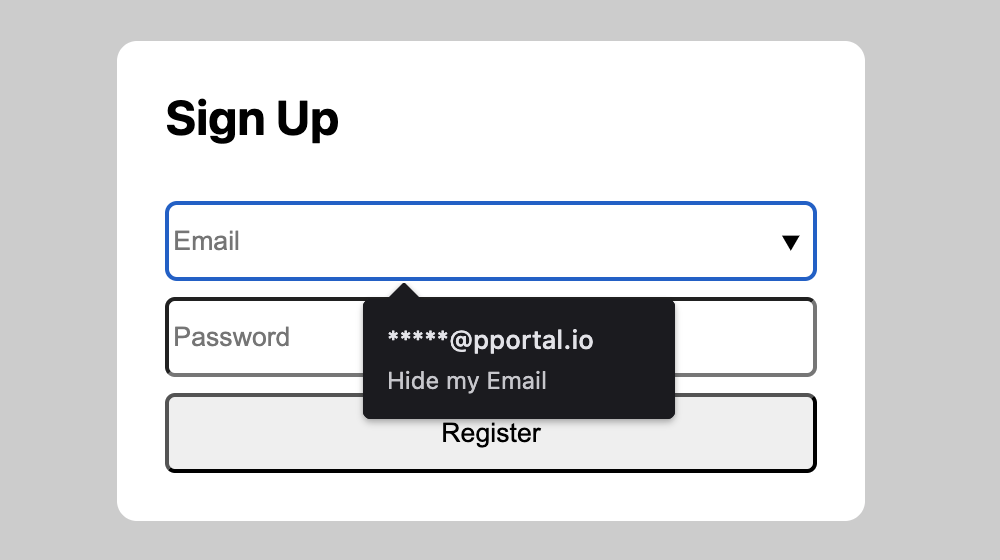
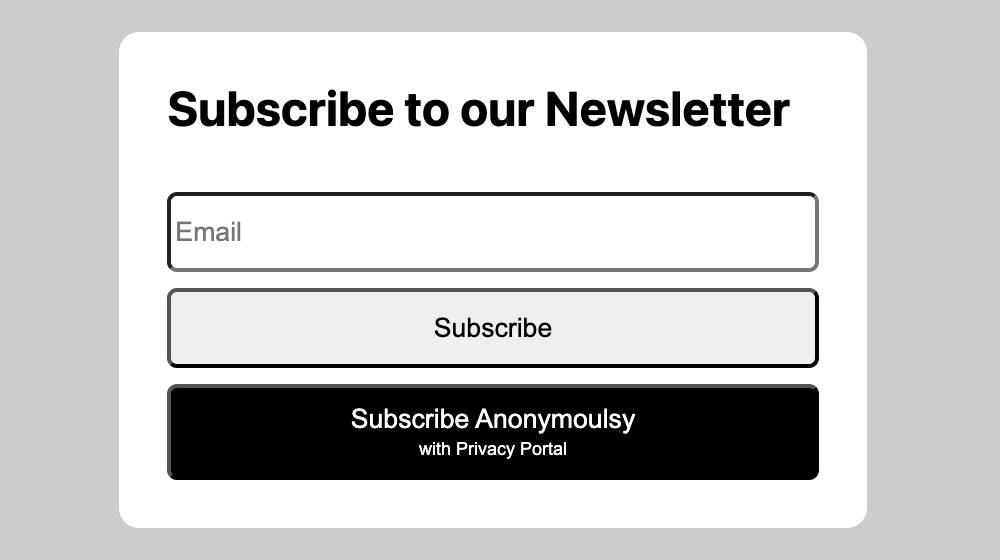

# privacy-kit

[](LICENSE)
[](https://privacyportal.github.io/privacy-kit-demo/index)

A lightweight browser library for integrating awesome privacy features to your website, proudly offered as Free and Open Source Software (FOSS) by our team at [Privacy Portal](https://privacyportal.org).

Features in this library could require users to sign-in or register free accounts on [Privacy Portal](https://privacyportal.org). This account registration is required for the operation of the user requested features.

Please check our [Privacy Policy](https://privacyportal.org/privacy) and [Terms Of Service](https://privacyportal.org/tos) for more information.

## Live Demo

🚀 Experience privacy-kit live: [privacyportal.github.io/privacy-kit-demo](https://privacyportal.github.io/privacy-kit-demo/index)

## Installation

**npm/yarn/pnpm:** (best for privacy)
```bash
npm install @privacyportal.org/privacy-kit
```

```js
import PrivacyKit from '@privacyportal.org/privacy-kit'

PrivacyKit.run({
  // Learn how you can get a client_id in the configuration section below
  client_id: process.env.CLIENT_ID
})
```

**Manual:** (best for privacy)
```html
<!-- Manually download the privacy-kit.umd.js file from our latest GitHub Release -->
<script src="/assets/privacy-kit.umd.js"></script>
<script>
  window.PrivacyKit.run({
    client_id: "<YOUR_OAUTH_CLIENT_ID>"
  });
</script>
```

**CDN (Script Tag):**
```html
<!-- Specific version with SRI -->
<script 
  src="https://cdn.jsdelivr.net/npm/@privacyportal.org/privacy-kit@0.0.8/dist/privacy-kit.umd.js"
  integrity="sha384-pLMsaJRS31WeeN6OAaNGwr8tDB0Zc06Bs1jd94b/uI4QayH2kQIyCqdMshWZ0dMA"
  crossorigin="anonymous"
></script>

<!-- Latest minor version -->
<script
  src="https://cdn.jsdelivr.net/npm/@privacyportal.org/privacy-kit@0/dist/privacy-kit.umd.js"
  crossorigin="anonymous"
></script>
```

## Configuration

```js
PrivacyKit.run({
  client_id: "<YOUR_OAUTH_CLIENT_ID>",
  enable_hide_my_email: true,
  enable_subscribe_anonymoulsy: true,
  on_error: "alert"                     // accepted values: ["ignore", "alert", loggerObject]
});
```

### How to get a client_id?

Privacy-Kit authorizes users using Privacy Portal's Open Authentication service. When a user requests a new alias, a Privacy Portal popup appears allowing users to securely authenticate with [Privacy Portal](https://privacyportal.org) and authorize your application to receive an email alias for the user.

In order to get a `client_id`, you must register your website as an OAuth Application on Privacy Portal. [Learn More](docs/app-registration.md)

## Features

### Hide-My-Email

Integrate _Hide My Email_ functionality to your website without requiring any browser extension or app installation. Simply install the library on your website using one of the installation steps above and make sure `enable_hide_my_email` is configured to `true` (it is enabled by default).



When enabled, if a user clicks on an email input field, they are prompted to use "Hide My Email" to generate a Privacy Email Alias instead of their personal email. This email alias protects the user's privacy and only accepts emails from your registered domains thus preventing email address theft by third parties and completely eliminating unsollicited mail.

In order to use _Hide My Email_, you will need to register your application as an OAuth application on Privacy Portal. Our free plan is very generous and should cover most websites.

### Subscribe Anonymously to Newsletter

Allow users to subscribe anonymously to your existing newsletter using email aliases instead of their personal email addresses. Simply install the library on your website using one of the installation steps above and make sure `enable_subscribe_anonymoulsy` is configured to `true` (it is enabled by default).



This features can very easily be integrated to your newsletter simply by adding an HTML button inside your form.

```html
<form>
  <input type="email" name="form_fields[email]" id="form-field-email" placeholder="Email" required="required">
  <button type="submit">Subscribe</button>
  <!-- Add the following button to your newsletter form -->
  <button type="button" data-pp-action="subscribe-anonymously">
    <span>Subscribe Anonymously</span>
    <span>with Privacy Portal</span>
  </button>
</form>
```

```css
/* you can style the subscribe anonymously button with some css like the following */
button[data-pp-action="subscribe-anonymously"] {
  display: flex;
  flex-direction: column;
  justify-content: center;
  background-color: black;
  color: white;
  height: auto;
  padding: 0.5rem;
  gap: 0.1rem;
}

button[data-pp-action="subscribe-anonymously"] > span:last-child {
  font-size: xx-small;
}
```

In order to use _Subscribe Anonymously_, you will need to register your application as an OAuth application on Privacy Portal. Our free plan is very generous and should cover most websites.