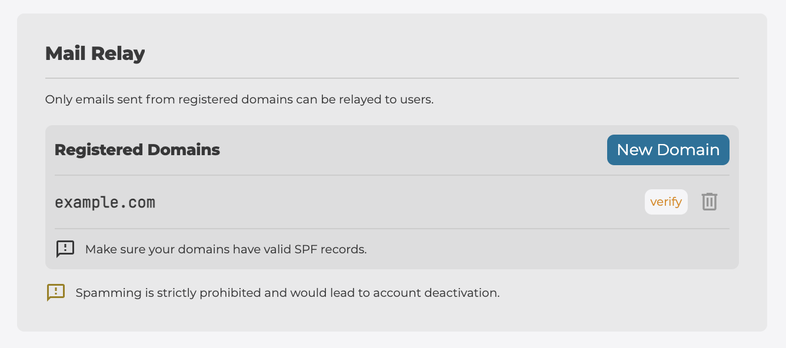
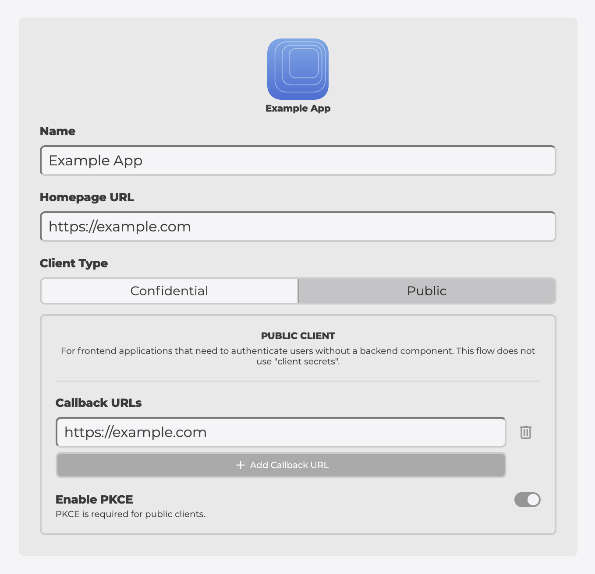
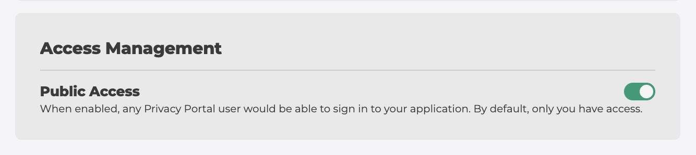

# Registering Your Application

In order to get a `client_id` you must register your app (or website) on [Privacy Portal](https://app.privacyportal.org).

1. Go to the [Privacy Portal Application](https://app.privacyportal.org/settings/developers)
2. Tap on "New Application".
3. Fill in the name of your Application under "Name" and the URL of your website both under the "Homepage URL" and under "Callback URL", then tap on Register.

## Configure your application

1. Set the `Client Type` to `Public` under `App Info` then save.

2. Enable `Public Access` under `Access Management`.

3. Tap on `verify` on your application domain under `Mail Relay > Registered Domains`. Email aliases only accept emails from registered and verified domains.
  a. Add a DNS record on your domain in order to verify your domain. Domain verification might take some time for the DNS data to propagate (in some cases, it can take more than 10 mins).
  b. In case you expect to send emails to users from other domains you own, you must add them and verify them under `Registered Domains`.

Note that the privacy-kit library only supports `Public` clients at the current time. For the use cases of _Hide My Email_ and _Subscribe Anonymously_, the `Public` client can work for all websites and applications.
